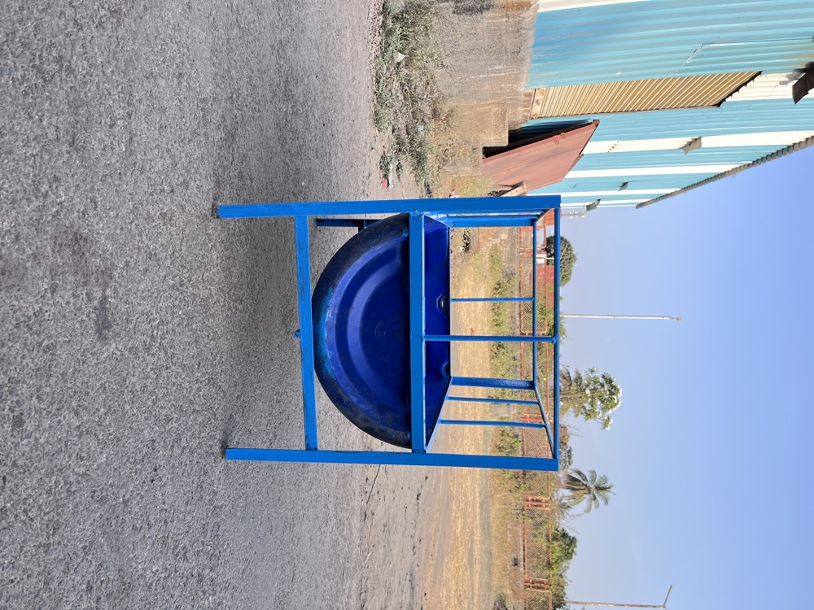
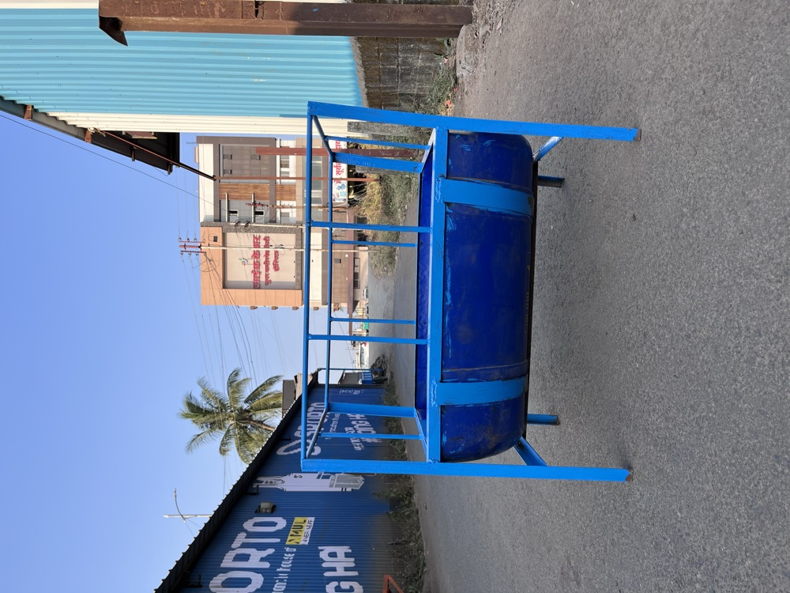
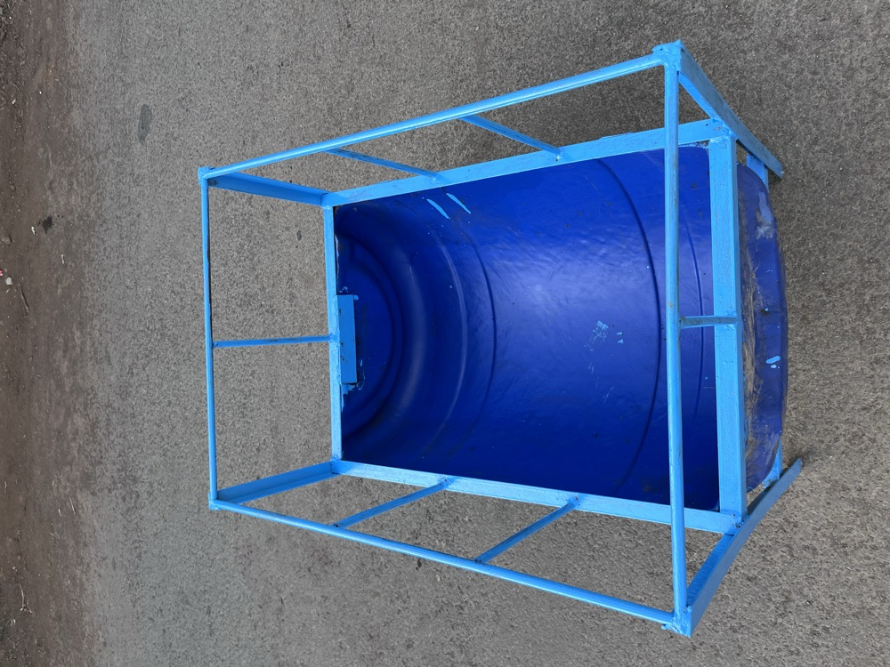

# यशवंत इंजिनिअरिंग अँड वेल्डींग वर्क्स
## YASHWANT ENGINEERING & WELDING WORKS

**Manufacturer of Tractor Trolleys, Farm Carts (Gada) & Cattle Equipment**

पलूस-तासगांव रोड, लाईफकेअर हॉस्पिटल समोर, पलूस, जि. सांगली, महाराष्ट्र

📞 संजय माळी — **9960022128** &nbsp;|&nbsp; 📞 संकेत माळी — **9359813768** &nbsp;|&nbsp; Instagram **@yashwant__engineering_palus**

---

**Date :- 27-9-2026** &nbsp;&nbsp;&nbsp;&nbsp;&nbsp; **Rates are valid for One Month Only\***

---

## 1. Tractor Trolleys — ट्रॅक्टर ट्रॉली

| No. | Product | Photos | Specification | Price |
|:---:|:---:|:---:|:---|:---:|
| **101** | **बॉक्स ट्रॉली** Box Trolley (Red / Blue) |    | Type :- **Single Axle, 2 Wheel** Body :- **Full Sheet Box Body** Floor :- **Plain Sheet Floor** Size :- **6 x 4 ft** Hitch :- **Drawbar with Ring Hook** Stand :- **Front Support Stand** Colour :- **Red Sides / Blue Floor** (custom colour available) Front Guard :- **Pipe Railing** | **₹17,000 – ₹19,000** |
| **102** | **पट्टी ट्रॉली** Patte Trolley (Jali Body) |    | Type :- **Single Axle, 2 Wheel** Body :- **Pipe Grill (Jali) Sides** Floor :- **Strip (Patti) Floor** Size :- **6 x 4 ft** Hitch :- **Drawbar with Ring Hook** Stand :- **Front Support Stand** Colour :- **Blue Body / Black Chassis** Rear :- **Openable Back Door** | **₹12,000 – ₹16,000** |

## 2. Farm Carts — गाडा

| No. | Product | Photos | Specification | Price |
|:---:|:---:|:---:|:---|:---:|
| **201** | **द्राक्षबागेचा गाडा** Grapes Gada (Vineyard Cart) |    | Type :- **3 Wheel Push Cart** Front Wheel :- **Single Steering Wheel** Floor :- **Strip (Patti) Floor** Sides :- **Pipe Railing on Both Sides** Size :- **3 x 7 ft** Handle :- **Full Width Push Handle** Colour :- **Blue** Use :- **Crates, grapes & fertiliser inside vineyard rows** | **₹10,000 – ₹12,000** |
| **202** | **मोटर सायकलचा गाडा** Motorcycle Gada (Bike Trolley) |    | Type :- **Bike-Towed Trailer** Wheels :- **2 Main Wheels + Support Wheel** Floor :- **Strip (Patti) Floor** Sides :- **Pipe Railing** Hitch :- **Fits Behind Motorcycle** Size :- **—** Colour :- **Blue** Use :- **Milk cans, fodder, farm produce** | **On Request** |

## 3. Cattle Equipment — जनावरांसाठी साहित्य

| No. | Product | Photos | Specification | Price |
|:---:|:---:|:---:|:---|:---:|
| **301** | **जनावरांची गव्हाण** Cattle Feeder (Drum Type) |    | Type :- **Stand Type Feeder** Trough :- **Heavy Plastic Drum (Half Cut)** Frame :- **MS Pipe Stand** Guard :- **Pipe Cage on Top (stops fodder wastage)** Size :- **—** Colour :- **Blue** Use :- **Fodder & water for cows, buffaloes, goats** | **On Request** |

---

**Custom sizes & colours available &nbsp;•&nbsp; Bulk order discount &nbsp;•&nbsp; Delivery in Sangli district**

Monday – Saturday : 9 AM – 6 PM

*Prices may change with steel rates. Please call to confirm before ordering.*

